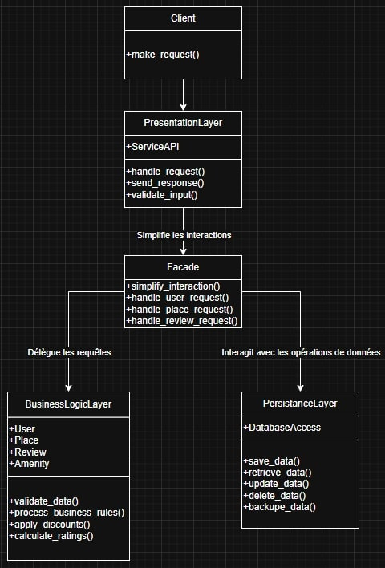
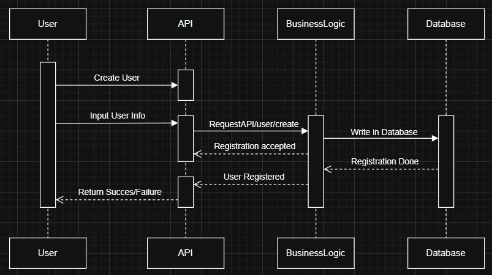
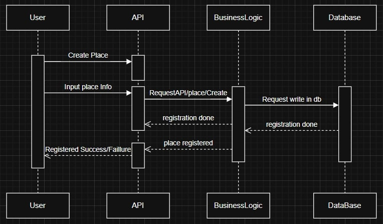
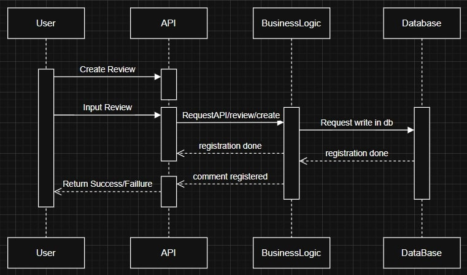
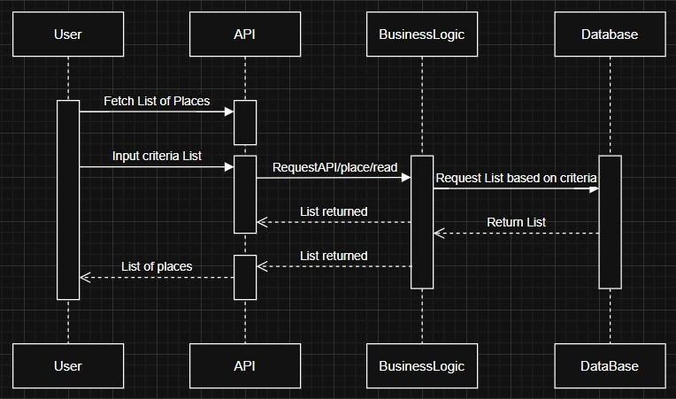

# Comprehensive Technical Document for HBnB Project 

 

## 1. Introduction 

**Purpose of the Document**: 
This document serves as a detailed blueprint for the HBnB project, a simplified version of Airbnb.
It provides a comprehensive overview of the system's architecture, design, and interactions through diagrams and explanatory notes.
The document will guide the implementation phases and serve as a reference for developers, ensuring consistency and clarity throughout the project. 

**Scope of the Project** 

The HBnB project aims to create a web application that allows users to: 

* Register and authenticate themselves.
* Create and manage property listings.
* Submit reviews for properties.
* Search and view a list of available properties. 

This document focuses on the high-level architecture, business logic layer, and API interaction flows,
providing a clear understanding of the system's design and functionality. 

 

## 2. High-Level Architecture 

**High-Level Package Diagram**: 
 

 
 
**Explanatory Notes**: 

- **Layered Architecture**: The system is divided into layers to promote separation of concerns, making the application modular, scalable, and easier to maintain. 
- **Facade Pattern**: The facade layer acts as an intermediary between the presentation layer and the business logic layer, simplifying complex interactions and ensuring loose coupling. 
- **Persistence Layer**: This layer interacts with the database to store and retrieve data, ensuring data integrity and consistency. 

 

## 3. Business Logic Layer 

**Detailed Class Diagram**:

[Click here to see diagram](https://app.diagrams.net/#G1es0sS85BDmLfkTrpuBMlcameV20_ycK5#%7B%22pageId%22%3A%224iQGp0F2QipZq8b3e1VB%22%7D)

**Explanatory Notes**:

 <ins>**Entities**</ins>: 

* User: Represents a user of the system, with attributes like name, email, and password. 
* Place: Represents a property listing, with attributes like title, description, price, and location. 
* Review: Represents a review submitted by a user for a place, with attributes like rating, comment, and date. 
* Amenities: Are properties features, like air conditionning, a swimming pool...

These four entities are the backbone of the app, as they both provide the class for back-end management of their instances, and data modeling for writing into the Persistence Layer's Data Base (DB) through de Gateway classes reponsible for transmitting the queries to the Database Client Service class. More about these classes is explained below.

<ins>**Design Decisions**</ins>: 

The app has to match the Facade design pattern for smooth and flawless implementation of its different features. The facade pattern relies on a facade class to provide instantiation of some kind of "entry object", thanks to which all underlying objects and methods will unfold as they are needed as remote from the user as possible.

This Facade class is called by every API routing function matching all possible operations carried out by a user of the app. Each API call made by the user from the JavaScript layer of the UI reaches a back-end routing function whose job is to provide an entry point for the desired operations (communication with the DB, external API calls...) and attached data (picked up from the body of the HTTP request). Complying with the microframework philosophy of the Flask framework, these routing functions are all stand-alone functions, unrelated to any kind of class. A back-end relying on a Django framework would probably work the other way around to match its class-oriented approach. Once instantiated, the Facade Class object allows for the instantiation of entity-specific facades providing a type level. The Facade pattern keeps unfolding as each entity facade instantiates Entity Gateways objects, providing a method level, hence access to the entity's methods (such as register for a user). The data from the API call is then matched to our four main entity classes, for format validation. This allows the Entity Gateways to submit requests to the DB Client Service class, which interfaces with the DBMS.

This Facade design enforces the Single Responsibility Principle, strictly delimiting each class's perimeter.

In other words, a single-entity operation would end-up with an API routing function instantiating a Facade object, and then return an object.entity.method(data) statement.
```
# CASE 1: Single-entity operation
# Only instantiates facade and uses domain facade directly
@app.route('/api/users/register', methods=['POST'])
def register_user():
    data = request.get_json()
    app_facade = ApplicationFacade()  # Just instantiation
    return app_facade.users.register(data)  # Direct use of domain facade
```

A cross-entity or complex operation, however, would call a method directly implemented in the Facade Class. This way, a simple Facade object is created fron the user's API call, and the Facade class handles orchestrating all the back-end work.
```
# CASE 2: Cross-entity operation
# Instantiates facade AND calls coordination method
@app.route('/api/bookings/create', methods=['POST'])
def create_booking():
    data = request.get_json()
    app_facade = ApplicationFacade()  # First instantiation
    # Then calls cross-entity method
    return app_facade.create_booking_with_validation(  
        user_id=data['userId'],
        property_id=data['propertyId'],
        dates=data['dates']
    )
```

In this Facade pattern, our four entity classes (User, Place, Review, Amenity) are the keystone, deep in the core of the design.

<ins>**Entities Relationships**</ins>:

* The User class is central to the system, as it interacts with both Place and Review. It is then "used by both". It would seem appropriate to not set up a dependency of the Review entity towrds the User class so that reviews can be persisted, as they remain relevant, after a user is deleted.
* The Place class aggregates Review and Amenity objects, ensuring that reviews are tied to specific properties.
* The use of encapsulation ensures that each class manages its own data and behavior, promoting modularity and reusability.

Overall, the relationships are :

Generalization (inheritance):
* BaseFacade -> EntityFacades
* BaseGateway -> EntityGateways
* BaseModel -> EntityModels

Composition:
* ApplicationFacade owns EntityFacades
* EntityFacades own their respective EntityGateways

Dependency:
* EntityGateways depend on EntityModels
* EntityFacades depend on their EntityGateways
* All Gateways depend on DatabaseClient

Association:
* EntityGateways are associated with their corresponding EntityModels
* EntityFacades are associated with their corresponding EntityGateways
* ApplicationFacade is associated with all EntityFacades

Aggregation:
* User class aggregates places objects (as an owner) or reviews objects (as an author)
* Place class aggregates amenity objects (as features or services) and reviews (as their main topic)

No realization (interface implementation) relationships are present in this structure.

## 4. API Interaction Flow 

**Sequence Diagrams**: 

<ins>**User Registration**</ins>: 



* The user submits registration details (e.g., name, email, password) through the presentation layer. 
* The facade layer validates the input and passes it to the business logic layer. 
* The business logic layer creates a new User object and saves it to the database via the persistence layer. 

<ins>**Place Creation**</ins>: 



* The user submits property details (e.g., title, description, price) through the presentation layer.
* The facade layer validates the input and forwards it to the business logic layer.
* The business logic layer creates a new Place object, associates it with the logged-in user, and saves it to the database. 

<ins>**Review Submission**</ins>: 



* The user submits a review (e.g., rating, comment) for a specific property.
* The facade layer validates the input and passes it to the business logic layer.
* The business logic layer creates a new Review object, associates it with the corresponding Place and User, and saves it to the database. 

<ins>**Fetching a List of Places**</ins>: 



* The user requests a list of available properties.
* The facade layer forwards the request to the business logic layer.
* The business logic layer retrieves the list of Place objects from the database and returns it to the presentation layer for display. 

 

***Conclusion*** 

This document provides a comprehensive overview of the HBnB project's architecture, business logic, and API interactions.
By following this blueprint, developers can ensure a consistent and efficient implementation process.
The diagrams and explanatory notes serve as a reference for understanding the system's design and functionality,
ensuring that all components work together seamlessly. 

 
